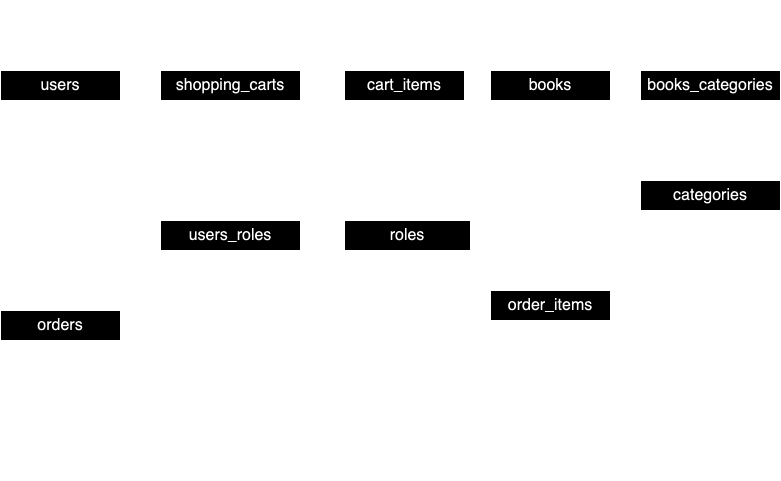

# Bookstore Online Application

Welcome to our Bookstore Online Application! 📖

Have you ever wondered how important books are in our lives? We learn new information from books, we read them in order to visit places we have never been and take the place of the main character.
Given the time of the latest technologies, we are very used to shopping on the Internet, because it is fast, affordable and simple.
If you have a small book store and want to enter the online market, then this project is for you.
It will be able to cover most of the basic needs of your store in the server part. If you are interested, please read the entire description and get more detailed information about it.

## Technologies Used

* **Spring Boot:** For building the backend application with ease and speed.

* **Spring Boot Starter Web:** Provides essential components for building RESTful web services.

* **Spring Security:** Ensures secure authentication and authorization using JWT tokens.

* **Spring Data JPA:** Provides easy integration with the database for data persistence.

* **Swagger:** Offers a clean and interactive documentation of the API endpoints.

* **Docker:** Facilitates containerization for easy deployment and scalability.

* **Liquibase:** Manages database schema changes and versioning, ensuring smooth database migrations.

* **MySQL Database:** Relational database management system used for storing application data.

## Functionality

### Authentication and Authorization

* Users must authenticate themselves through JWT tokens to access the functionalities of the application.

* All endpoints except authentication, swagger, and errors require user authentication.

### Online Bookstore

* Depending on the level of access, the user can perform certain actions, in this application there are two roles: ADMIN and USER.
  
* If you use the application with an authorized ADMIN account, you have access to absolutely all endpoints of the application.
  
* If you use the application with the USER access level, the functions of your account are limited, you can read more about this by reading the documentation using Swagger

### Transmission

* Data between the server and the client is transmitted using JSON format.

* REST API architecture is used for communication between the server and the client.

## Configuration

To configure the application, you can use the `.env` file.

## Setting Up the Project

To set up the project, follow these steps:

1.	Clone the repository from GitHub.
2.	Create a .env file and set the necessary variables as described above.
3.	Navigate to the project directory.
4.	Configure your Docker Compose file (`docker-compose.yml`) for database and application configuration.
5.	Run docker-compose up to build and start the containers.
6.	Liquibase will automatically handle database migrations.

</img>

## Custom Data

Users will need to substitute their custom data for the following:

`MYSQLDB_ROOT_PASSWORD`: Replace it with your MySQL root password.

`MYSQLDB_DATABASE`: Choose a name for your MySQL database.

`MYSQLDB_LOCAL_PORT`: Set a local port for your MySQL database connection.

`MYSQLDB_DOCKER_PORT`: Set a Docker port for your MySQL database connection.

`SPRING_LOCAL_PORT`: Choose a local port for your Spring Boot application.

`SPRING_DOCKER_PORT`: Choose a Docker port for your Spring Boot application.

`DEBUG_PORT`: Choose a port for debugging purposes.

`MYSQLDB_USER`: Choose a MySQL database user.

`JWT_EXPIRATION`: Set the expiration time for JWT tokens.

`JWT_SECRET`: Choose a secret key for JWT token generation and validation.

## Challenges Faced

While developing this project, we encountered several challenges:

* Implementing secure authentication and authorization mechanisms.

* Ensuring seamless integration between Spring Boot and Spring Security.

* Designing efficient database models for book categorization and user management.

* Managing database schema changes and versioning with Liquibase.

## Conclusion

Our Bookstore Online Application aims to revolutionize the way users shop for books online. With its user-friendly interface, secure authentication system, and containerized deployment, we strive to provide a hassle-free experience for book lovers worldwide.
Feel free to explore the application and provide us with your valuable feedback!